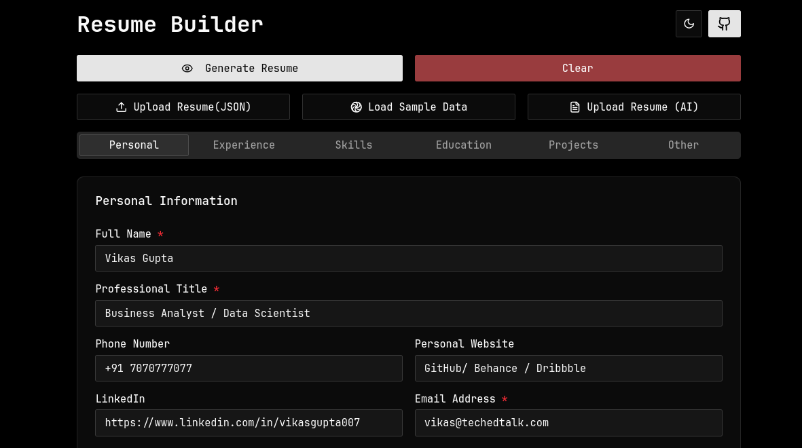

# Resume Builder mostly for Developers



A modern resume builder application designed specifically for developers to create, update, and manage professional resumes with ease.

## Features

- 📄 **Resume Upload & Update**: Upload your existing resume (PDF) and convert it to editable format
- 🔄 **Import/Export**: Save your resume as JSON for easy sharing and future editing
- ⬇️ **Download Options**: Export your resume in multiple formats (PDF)
- 🎨 **Custom Templates**: Choose from developer-friendly resume templates
- 🔍 **Real-time Preview**: See changes as you edit
- 🔒 **Local Storage**: Your data stays in your browser

## Quick Start

### Prerequisites

- Node.js (v16 or higher)
- pnpm or npm

### Installation

1. Clone the repository:

```bash
git clone https://github.com/yourusername/resume-builder.git
cd resume-builder
```

2. Install dependencies:

```bash
pnpm install
# or
npm install
```

3. Set up environment variables:

```bash
cp .env.example .env
```

(Edit the `.env` file if you want to use the Gemini API for AI features)

### Running the App

Start the development server:

```bash
pnpm dev
# or
npm run dev
```

Open [http://localhost:5173](http://localhost:5173) in your browser.

## Self-Hosting

### Building for Production

```bash
pnpm build
# or
npm run build
```

### Preview Production Build

```bash
pnpm preview
# or
npm run preview
```

### Deployment

The `dist` folder contains static files that can be deployed to any web server:

- Vercel
- Netlify
- GitHub Pages
- Any static hosting service

## Configuration

The `.env.example` file contains optional environment variables:

- `NEXT_PUBLIC_GEMINI_API_KEY`: For AI-powered features (optional)
- Other customization options

## Contributing

Contributions are welcome! Please open an issue or pull request.

## License

MIT

---

✨ **Happy resume building!** ✨
